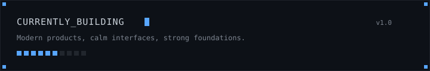
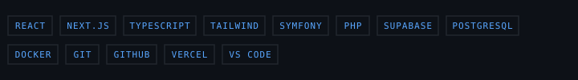

<div align="center">


<br/>

<p>
  <strong>Full Stack Developer</strong> &nbsp;•&nbsp; React &nbsp;•&nbsp; Next.js &nbsp;•&nbsp; Symfony &nbsp;•&nbsp; Supabase
</p>

<p>
  Building polished, scalable web experiences with thoughtful architecture and modern UI.
</p>

<p>
  Dumaguete City, Philippines
</p>


</div>

---

## About

I'm a Full Stack Developer focused on crafting fast, scalable, and beautiful web applications.

I enjoy turning product ideas into reliable digital experiences with React, Next.js, Symfony, and Supabase, blending clean architecture, performance, and thoughtful UI.

<div align="center">
  
</div>

```ts
const kenneth = {
  role: "Full Stack Developer",
  focus: ["Modern Web Apps", "UI Engineering", "Scalable Systems"],
  tools: ["React", "Next.js", "Symfony", "Supabase"]
}
```

---

## Tech Stack

<p align="center">
  
</p>

---

## Featured Projects

| Project | Focus |
| --- | --- |
| Sibulan Market Pay | Offline-first payment collection platform built with React, TypeScript, and Supabase. |
| Car Rental Management System | Enterprise-style rental management platform built with Symfony, Doctrine ORM, and PostgreSQL. |

---

## GitHub Highlights

<p align="center">
  
  
  
</p>

<p align="center">
  
  
</p>

<p align="center">
  <strong>Building thoughtful products, one commit at a time.</strong>
</p>

---

## Current Focus

- Shipping thoughtful UI systems
- Exploring scalable architecture patterns
- Learning deeper product-driven development
- Building with performance and clarity in mind

---

## Activity


---

## Connect

- GitHub — https://github.com/caducoykenneth1-dot
- Email — caducoykenneth1@gmail.com
