<div align="center">



<br/>

<p>
  <strong>Full Stack Developer</strong> • React • Next.js • Symfony • Supabase
</p>

<p>
  Building polished, scalable web experiences with thoughtful architecture and modern UI.
</p>

<p>
  Dumaguete City, Philippines
</p>


</div>

---

## About

I'm a Full Stack Developer focused on crafting fast, scalable, and beautiful web applications.

I enjoy turning product ideas into reliable digital experiences with React, Next.js, Symfony, and Supabase, blending clean architecture, performance, and thoughtful UI.

<div align="center">
  <svg width="100%" height="120" viewBox="0 0 720 120" xmlns="http://www.w3.org/2000/svg" role="img" aria-label="Animated focus card">
    <defs>
      <linearGradient id="focusGlow" x1="0%" y1="0%" x2="100%" y2="0%">
        <stop offset="0%" stop-color="#38bdf8" stop-opacity="0.95"/>
        <stop offset="50%" stop-color="#fb923c" stop-opacity="0.95"/>
        <stop offset="100%" stop-color="#38bdf8" stop-opacity="0.95"/>
      </linearGradient>
    </defs>
    <rect x="6" y="6" width="708" height="108" rx="18" fill="#0b1220" stroke="#1f2937"/>
    <text x="28" y="42" fill="#f8fafc" font-family="Inter, Segoe UI, Arial, sans-serif" font-size="19" font-weight="700">Currently building</text>
    <text x="28" y="72" fill="#cbd5e1" font-family="Inter, Segoe UI, Arial, sans-serif" font-size="15">Modern products with calm interfaces, strong foundations, and a fast feel.</text>
    <path d="M28 96 C 120 84, 190 84, 260 96 S 420 108, 510 96 S 630 74, 690 84" stroke="url(#focusGlow)" stroke-width="3" fill="none" stroke-linecap="round">
      <animate attributeName="stroke-dasharray" values="0 1000; 500 500; 0 1000" dur="7s" repeatCount="indefinite"/>
    </path>
    <circle cx="660" cy="84" r="8" fill="#38bdf8">
      <animate attributeName="r" values="7;10;7" dur="2.4s" repeatCount="indefinite"/>
    </circle>
  </svg>
</div>

```ts
const kenneth = {
  role: "Full Stack Developer",
  focus: ["Modern Web Apps", "UI Engineering", "Scalable Systems"],
  tools: ["React", "Next.js", "Symfony", "Supabase"]
}
```

---

## Tech Stack

<p align="center">


</p>

---

## Featured Projects

| Project | Focus |
| --- | --- |
| 🌐 Sibulan Market Pay | Offline-first payment collection platform built with React, TypeScript, and Supabase. |
| 🛠️ Car Rental Management System | Enterprise-style rental management platform built with Symfony, Doctrine ORM, and PostgreSQL. |

---

## GitHub Highlights

<p align="center">


</p>

<p align="center">


</p>

---

## Current Focus

- ⚡ Shipping thoughtful UI systems
- 🧠 Exploring scalable architecture patterns
- 🌱 Learning deeper product-driven development
- 🚀 Building with performance and clarity in mind

---

## Activity


---

## Connect

- GitHub — https://github.com/caducoykenneth1-dot
- Email — caducoykenneth1@gmail.com
